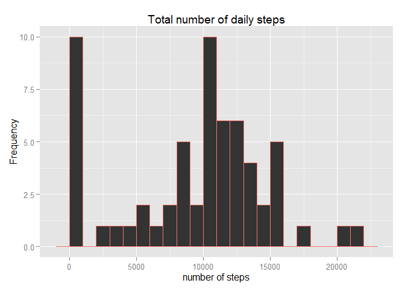
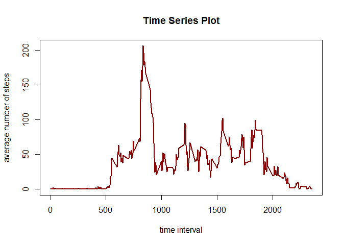

# Reproducibility Project
axelle.cb  
Sunday, April 19, 2015  

**INTRODUCTION**
It is now possible to collect a large amount of data about personal movement using activity monitoring devices such as a Fitbit, Nike Fuelband, or Jawbone Up. These type of devices are part of the "quantified self" movement - a group of enthusiasts who take measurements about themselves regularly to improve their health, to find patterns in their behavior, or because they are tech geeks. But these data remain under-utilized both because the raw data are hard to obtain and there is a lack of statistical methods and software for processing and interpreting the data.

This assignment makes use of data from a personal activity monitoring device. This device collects data at 5 minute intervals through out the day. The data consists of two months of data from an anonymous individual collected during the months of October and November, 2012 and include the number of steps taken in 5 minute intervals each day.

**Loading and preprocessing the data**
 - Load the data 
 - Process/transform the data (if necessary) into a format suitable for your analysis
 

```r
#Set up workspace and clean up data 
rm(list = ls())
library(ggplot2)
library(plyr)
setwd("C:/Users/Axelle/Documents/R/RD Project 1/RResearchProject1")

# Loading and pre-processing the data
data <- read.csv("activity.csv", sep=",", na.strings="NA", colClasses =c("numeric","Date","numeric"))
```

**What is mean total number of steps taken per day?**
- Calculate the total number of steps taken per day
- Make a histogram of the total number of steps taken each day
- Calculate and report the mean and median of the total number of steps taken per day


```r
# A. What is the total number of steps taken per day
## A.1.Calculate the total number of steps taken per day
daily_steps <- aggregate(steps~date, data=data, FUN=sum, na.rm=T)

## A.2. Histogram of steps per day:
tot_steps <- tapply(data$steps, data$date, FUN=sum, na.rm=TRUE)
```

 


```r
## A.3. Mean and Median of total number of steps/day
mean_steps <- round(mean(daily_steps$steps), 2) #[1] 10766.19
median_steps <- quantile(x = daily_steps$steps, probs = 0.5) #10765 
```

**What is the average daily activity pattern?**
- Make a time series plot of the 5-minute interval (x-axis) and the average number of steps taken, averaged across all days (y-axis)
- Which 5-minute interval, on average across all the days in the dataset, contains the maximum number of steps?

```r
# B. What is the average daily activity pattern
## B.1. Time series plot of the 5mnt interval and the average number of steps taken, averaged accross all days
### Find the means of steps for each interval
steps_int <-aggregate(data$steps ~ data$interval, FUN=mean, na.rm=T)
colnames(steps_int) <- c("Interval","Mean")

### Create time series plot from above calculations
```

 


```r
##B.2. Find the interval with the maximum number of steps:
steps_int[which.max(steps_int$Mean),] #Interval 835, Mean 206.1698
```

```
##     Interval     Mean
## 104      835 206.1698
```

**Imputing missing values**
-Calculate and report the total number of missing values in the dataset (i.e. the total number of rows with NAs)
- Devise a strategy for filling in all of the missing values in the dataset. The strategy does not need to be sophisticated. For example, you could use the mean/median for that day, or the mean for that 5-minute interval, etc.
- Create a new dataset that is equal to the original dataset but with the missing data filled in.
- Make a histogram of the total number of steps taken each day and Calculate and report the mean and median total number of steps taken per day. Do these values differ from the estimates from the first part of the assignment? What is the impact of imputing missing data on the estimates of the total daily number of steps?

```r
#C. Inputing Missing Values
##C.1. Find total number of missing values in dataset
missing_values <- is.na(data$steps)
nbr_missing <-sum(as.numeric(missing_values))
nbr_missing # [1] 2304
```

```
## [1] 2304
```

```r
##C.2. Devise a strategy for filling in missing values
### The insertion strategy will consist of replacing the missing value by the mean value of steps for its interval
     
##C.3. Fillin in missing values
### Create a new data set
data2 <- data 

### Again, find the means of steps for each interval
steps_int <- aggregate(data$steps ~ data$interval, data, FUN=mean, na.rm=T)
colnames(steps_int) <- c("Interval","Mean")

###Plug in the new values
int_mean <-tapply(data$steps, data$interval,mean, na.rm=TRUE)

for (i in which(is.na(data2)))
    {
    data2[i,1] <- int_mean[((i-1)%%288)+1]
    }

###Check that the number of NA = 0
missing_values2 <- is.na(data2$steps)
nbr_missing2 <-sum(as.numeric(missing_values2))
nbr_missing2
```

```
## [1] 0
```

```r
#[1] 0

##C.4. New histogram, mean, and median of total steps/day
###New Total of steps per day
daily_steps2 <- aggregate(steps~date, data=data2, FUN=sum, na.rm=T)

### new mean and median
mean_steps2 <- round(mean(daily_steps2$steps), 2)#[1] 10766.19
median_steps2 <- quantile(x = daily_steps2$steps, probs = 0.5)# 10766.19 
###New histogram 
tot_steps2 <- tapply(data2$steps, data$date, FUN=sum, na.rm=TRUE)
```

 

**Are there differences in activity patterns between weekdays and weekends?**
-Create a new factor variable in the dataset with two levels - "weekday" and "weekend" indicating whether a given date is a weekday or weekend day.
-Make a panel plot containing a time series plot (i.e. type = "l") of the 5-minute interval (x-axis) and the average number of steps taken, averaged across all weekday days or weekend days (y-axis). See the README file in the GitHub repository to see an example of what this plot should look like using simulated data.

```r
#D. Are there differences between weekdays and weekends?
##D.1. Create a new factor variable indicating day type
data2<- data.frame(date=data2$date, weekday=weekdays(data2$date),steps=data2$steps, interval=data2$interval)
data2<-cbind(data2,type_day=ifelse(data2$weekday=="Saturday"|data2$weekday=="Sunday","WE","WD"))

##D.2. Create a time series plot for weekends and weekdays
ave_type <- ddply(data2, .(interval,type_day), summarize, steps = mean(steps, na.rm=TRUE))
```

 


